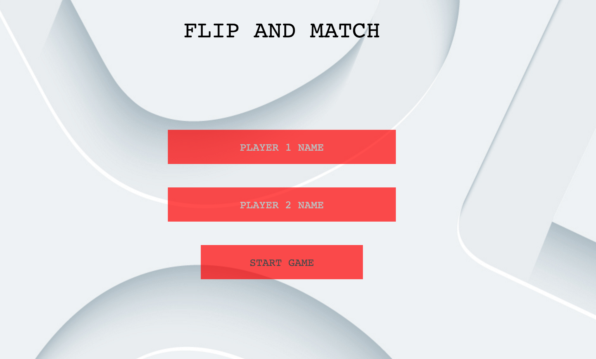
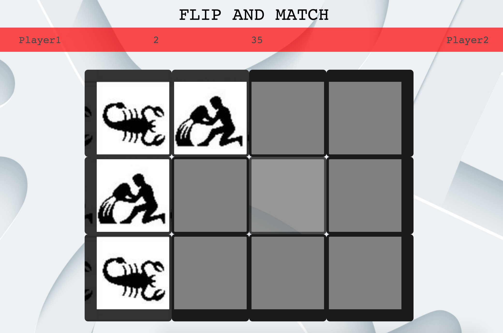

#[FLIP AND MATCH](https://anilrayamajhi.github.io/Project_1/)
---
###About Game:
Turn by turn two player game, with simple flip and match logic. Game launches with a splash screen letting player to enter name.  
Once the game starts it triggers timer simultaneously which is set to stop as first player accomplish the complete match and vice versa. The game is set to record the accomplishment time of each player and publish the winner or draw depending upon the time each player consumed.

###Instructions:
1. Enter players name for game record; else default name gets displayed. 
2. Game starts with timer.
3. Game records the time, player consumed to finish.
4. Based on the time it declares the winning player or draw.
5. Timer and scores appears in navigation to enable player to track progress and status.
6. Game can be restarted any time using restart game button

---

###Controls:
This is click drivin game. Key is used only the time game requests.

---
###Run Locally:
1.	Download the zip, or clone the repo.
2.	Open Terminal and navigate to the project folder.
3. Click on heading.

###Play online:
To play this game online please <b>[Click here](https://anilrayamajhi.github.io/Project_1/)</b>

###Technology Used:
* HTML
* CSS
* JavaScript
* JQuery

###Lags:
1. Game should increase the difficulty depending on user selection.
2. Layout more focused for children
3. Animation

###User Stories
1. As a player, I have an option to enjoy multiple screen in single URL
2. As a player, I can put my name to better track status
3. As a player, I can restart game when ever I prefer
4. As a player, I can track my time and score simultaneously.
5. As a player, I can enjoy game without partner since it is time based game and I can compete with my self.
6. As a player, I have the experience of winning more personalize.

###Future implementations
1. As a player, I can allow user to pick the level of difficulty.
2. As a player, I can have more options of images to choose from.
3. As a player, I can have 

###Acknowledgements:
Credits: 

* Original creator
* pictures and audio